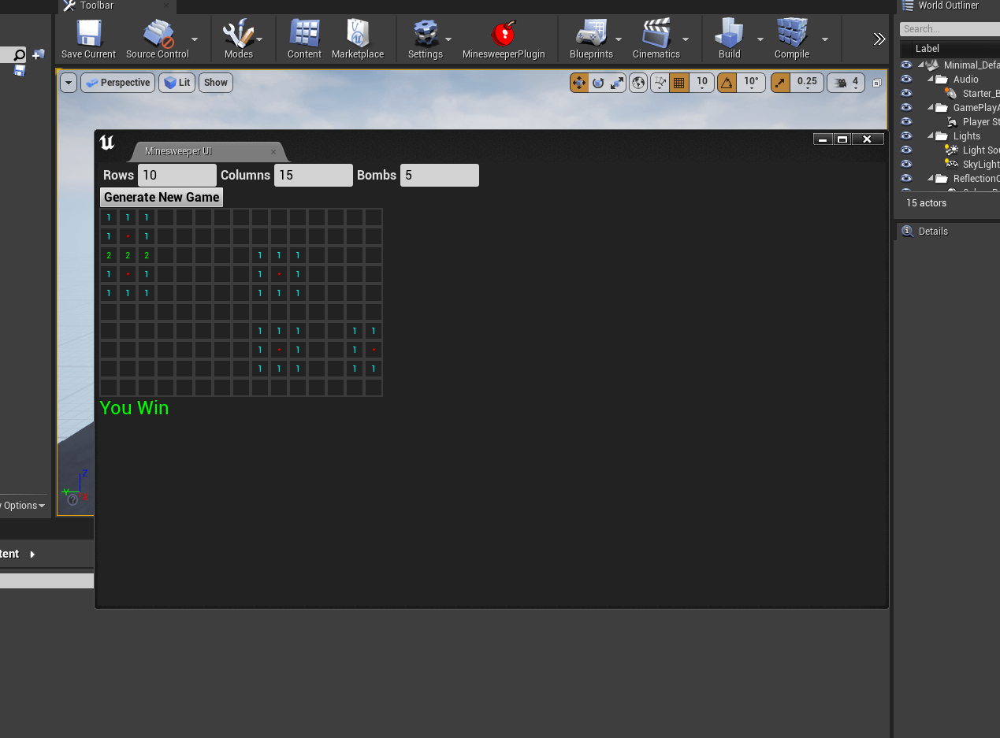
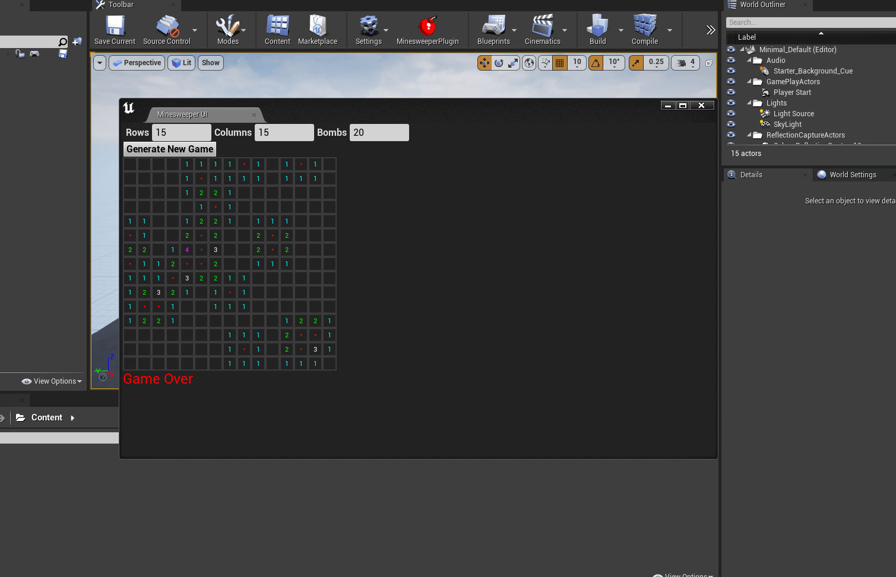

# Unreal-Minesweeper-Slate-Plugin


**Engine Version:** 4.27

Minesweeper Toolbar plugin made in Unreal 4. This plugin will add a toolbar button to the top of the editor that will spawn a new tab allowing the user to play Minesweeper. Minesweeper was made using Slate elements. Users will be able to adjust how many rows, columns, and mines are present on the game board, each has a max of 30. The design is very simplistic. 

All the code is found in `Plugins/MinesweeperPlugin/Source/MinesweeperPlugin`

### Set up
```
git clone git@github.com:Harrison1/Unreal-Minesweeper-Slate-Plugin.git

cd Minesweeper

start Minesweeper.sln
```
***You might have to right click on the Minesweeper.uproject and Click Generate Visual Studio project files***

## Home


## Default Grid


## Game Over


## Win Screen


## Big Game Over Grid


Bomb image source: [cleanpng.com](https://www.cleanpng.com/png-clip-art-portable-network-graphics-explosion-bomb-6996720/)